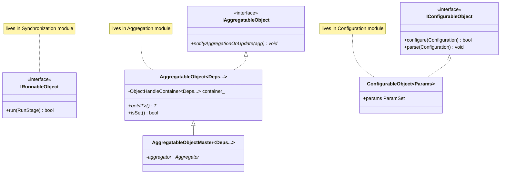
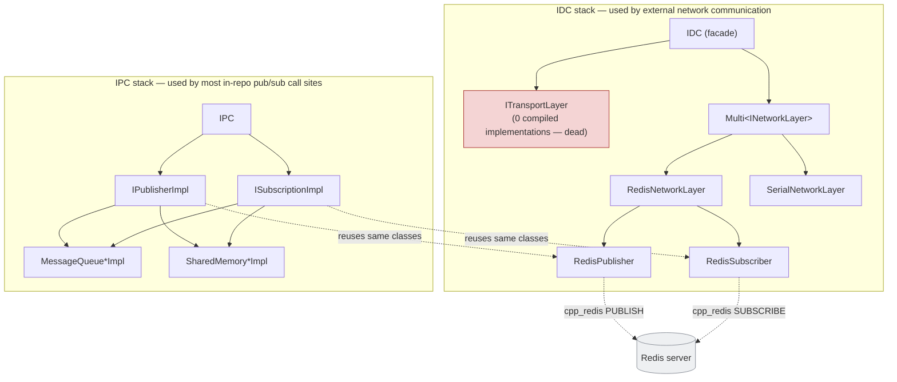
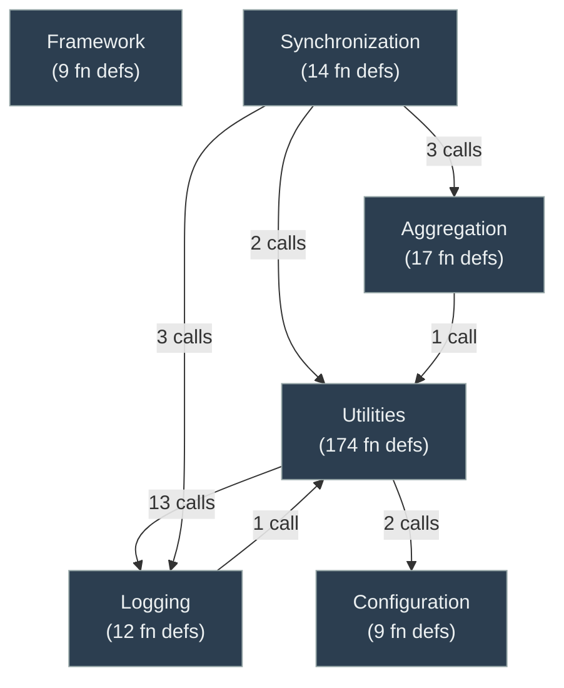

# CPSCore Architecture

CPSCore is an open-source, event-driven C++17 framework for cyber-physical systems, originally built as the core of the [uavAP](https://github.com/theilem) autopilot. ~13,000 LOC across 154 files, organized into five modules — **Aggregation**, **Configuration**, **Synchronization**, **Logging**, **Utilities** — sitting on a thin **Framework** glue layer. There is no `main()` in this repo: it is a library that a host application wires together from a JSON config file.

Everything in this document is grounded in the actual source (file:line references throughout) rather than the README's one-line summaries.

---

## 1. The core idea: what a "component" is

There is no `Component` base class. A **component** is any class that:

1. implements `IAggregatableObject` (almost always indirectly, via the `AggregatableObject<Deps...>` CRTP mixin),
2. exposes a `static constexpr typeId` string used both as its JSON config key and its factory-lookup key, and
3. is typically *also* `ConfigurableObject<Params>` (wants config values) and/or `IRunnableObject` (wants to run on the lifecycle clock).

These three concerns — **being discoverable** (Aggregation), **being configurable** (Configuration), and **being run** (Synchronization) — are orthogonal mixins a class opts into independently. A convenience header, `include/cpsCore/cps_object`, bundles all three for the common case.



*Correction to a common assumption:* none of `IAggregatableObject`, `IConfigurableObject`, `IRunnableObject` live in the "Framework" module — each lives in the module whose concern it defines (Aggregation, Configuration, Synchronization respectively). Framework only holds the generic, mostly header-only *plumbing* that stitches them together at startup: `StaticFactory`, `StaticHelper`, `PluginHelper`, `FrameworkAPI`.

---

## 2. How a component gets built, configured, and wired — end to end

This is the real spine of the framework. A host application calls one entry point, and five modules cooperate to turn a JSON file into a live, fully-wired object graph:

```mermaid
sequenceDiagram
    autonumber
    participant App as Host application
    box Framework
        participant SH as StaticHelper
        participant SF as StaticFactory
    end
    box Configuration
        participant CFG as Configuration.cpp
        participant CO as ConfigurableObject
        participant PM as PropertyMapper
    end
    box Aggregation
        participant AGG as Aggregator
        participant DC as DynamicObjectContainer
        participant OHC as ObjectHandleContainer
    end

    App->>SH: createAggregation(configPath)
    SH->>CFG: parseConfigFile(path)
    CFG-->>SH: json Configuration tree
    loop for each Object type in template list
        SH->>SH: addIfInConfig<Object>() — key present?
        SH->>SF: createObject<Object>(subConfig)
        SF->>SF: make_shared<Object>()
        SF->>CO: object->configure(subConfig)
        CO->>PM: PropertyMapper pm(subConfig)
        CO->>CO: params.configure(pm)  // c & p1; c & p2; ...
        PM-->>CO: pm.map() (all mandatory fields present?)
        SF-->>SH: shared_ptr<Object>
        SH->>AGG: agg.add(object)
        AGG->>DC: container_.add(object)
        DC->>DC: notifyAggregationOnUpdate(agg) for every stored object
        DC->>OHC: (per AggregatableObject<Deps...>) setFromAggregationIfNotSet(agg)
        OHC->>AGG: agg.getOne<Dep>() / agg.getAll<Dep>()  — resolve each declared dependency
    end
    SH->>SH: look up "plugin_helper" key → PluginHelper::loadPlugins()/createPlugins()
```

Key points:

- **`Aggregator`** (`include/cpsCore/Aggregation/Aggregator.h`) is the dependency-injection container: a thin façade over one `DynamicObjectContainer` (`container_`), which owns `std::vector<shared_ptr<IAggregatableObject>>`. `Aggregator::add()` delegates straight to the container, then the container calls `notifyAggregationOnUpdate` on *every* stored object — including ones added earlier — so wiring is idempotent and order-independent.
- **`ObjectHandleContainer<Deps...>`** (`include/cpsCore/Aggregation/ObjectHandleContainer.hpp:169-201`) is the actual client that calls `Aggregator::getOne<T>()`/`getAll<T>()` on behalf of every `AggregatableObject<Deps...>`-derived component — this is the one piece of code that resolves *every* dependency edge declared via the `AggregatableObject<Deps...>` template argument list in the whole codebase.
- **`PropertyMapper`** (`include/cpsCore/Configuration/PropertyMapper.hpp`) is a generic JSON-tree walker with one core method, `operator&(Param&)`, dispatched by type trait (`is_vector`, `is_eigen`, `is_enum_map`, `is_optional`, `is_parameter_set` for nested config blocks, …). A component's `ParameterSet::configure(Configurator&)` method (user-written, one `c & param;` line per field) is duck-typed — the exact same method also works with `JsonPopulator` (the write-direction inverse, used to serialize a live config back to JSON) and `TerminalConfigurator` (interactive stdin prompts), so one declaration serves three different configuration mechanisms.
- **`StaticFactory<SuperClass, ..., Objects...>`** and **`StaticHelper<Objects...>`** are compile-time-only constructs (no vtable, no dynamic registration) — "registering" a type is just listing it as a template parameter. There is a second, runtime path: **`PluginHelper`** `dlopen()`s a `.so` and calls its exported `register_plugin()` C function, which is expected to call `PluginHelper::registerPlugin<Type>()` — this is how types unknown at CPSCore's own compile time get added.
- **`FrameworkAPI`** (`include/cpsCore/Framework/api/FrameworkAPI.h`) is a process-wide singleton holding one global `Aggregator`. Independent subsystems build their own local `Aggregator`s and later `FrameworkAPI::getAggregator()->merge(localAgg)` folds them into the global one.

---

## 3. How a component gets *run*: the Synchronization lifecycle

Every runnable component implements one interface:

```cpp
enum class RunStage { INIT, NORMAL, FINAL, SYNCHRONIZE };   // IRunnableObject.h:31
virtual bool run(RunStage stage) = 0;
```

Synchronization provides **four different drivers** for that interface — not four runnable base classes, but four different *callers*:

| Driver | Process model | Fetches runnables | Coordination |
|---|---|---|---|
| `SimpleRunner` | single process | `agg.getAll<IRunnableObject>()` fresh **every call** to `runStage()` | none — caller drives stages directly |
| `AggregatableRunner` | single process | cached once, in `notifyAggregationOnUpdate` (itself is `IAggregatableObject`, so it gets wired like any other component) | none — caller calls `runAllStages()` |
| `SynchronizedRunnerMaster` | **multi-process master** | n/a — doesn't hold runnables itself | owns shared memory, broadcasts stage transitions |
| `SynchronizedRunner` | **multi-process worker** | `agg.getAll<IRunnableObject>()` once per process | blocks on the master's broadcast, reports completion |

The master/worker pair is the interesting one — it synchronizes independent OS processes through a named shared-memory segment (`"sync_run"`) holding a `Synchronizer` struct (mutex + condition variable + semaphore):

```mermaid
sequenceDiagram
    autonumber
    participant Master as SynchronizedRunnerMaster
    participant Shm as shared memory<br/>"sync_run" (Synchronizer)
    participant W1 as SynchronizedRunner (worker 1)
    participant W2 as SynchronizedRunner (worker 2)

    Master->>Shm: construct/truncate, runStage = SYNCHRONIZE
    par worker threads block
        W1->>Shm: wait on runStageChanged condition
        W2->>Shm: wait on runStageChanged condition
    end
    Master->>Shm: runStage = INIT; runStageChanged.notify_all()
    Shm-->>W1: wakes
    Shm-->>W2: wakes
    W1->>W1: for each runnable: run(INIT)
    W2->>W2: for each runnable: run(INIT)
    W1->>Shm: finishedStage.post()
    W2->>Shm: finishedStage.post()
    Master->>Shm: finishedStage.timed_wait() × numOfRunners (1s timeout each)
    Note over Master: on timeout → CPSLOG_ERROR "Module(s) timed out", failure = true
    Master->>Master: repeat for NORMAL, then FINAL
```

If a worker doesn't `post()` within the timeout, the master logs an error, sets a shared `failure` flag, and unblocks everyone — this is the framework's only cross-process fault-detection mechanism.

**A note on `StageEventBridge`/`StageEventListener`:** these two classes (`include/cpsCore/Synchronization/StageEventBridge.h`, `include/cpsCore/Aggregation/StageEventListener.h`) are *not* part of upstream CPSCore's runner set — their header comments reference "H1 scenario S4," meaning they were added specifically to construct the thesis's pub-sub dual-gap test case. `StageEventBridge::publishStage` fires a `boost::signals2::signal` that `StageEventListener::onStageEvent` subscribes to at runtime via `attachTo()` — a real signal/slot connection with no static call site, alongside a `CPSLOG_ERROR` fallback that gets suppressed via `CPSLogger::LogLevelScope(LogLevel::NONE)` if no listener is attached. Worth knowing this pair is thesis instrumentation, not organic CPSCore.

---

## 4. Logging — the one module everyone depends on

`CPSLogger` (`include/cpsCore/Logging/CPSLogger.h`) is a Meyers-singleton, leveled logger (`TRACE < DEBUG < WARN < ERROR < NONE`). `RAIILogStream` is **not** a subclass of `CPSLogger` — it's a stack-only RAII wrapper constructed fresh by every `CPSLOG_*` macro invocation, which immediately asks the singleton for the right `std::ostream&` and flushes on destruction:

```cpp
#define CPSLOG_ERROR CPSLOG(LogLevel::ERROR) << " [ERROR] " << "[" << __FILE__ << ":" << __LINE__ << "] "
#define CPSLOG(level) (RAIILogStream(level).stream())
```

**How `LogLevelScope(LogLevel::NONE)` suppression actually works** (mechanically relevant to the thesis's S4 scenario): it is a **runtime check-before-write**, not a compiled-out call. `LogLevelScope`'s constructor saves the current level and sets the singleton's level to `NONE`; its destructor restores it — a classic scope guard. While active, every `CPSLOG_*` call **still executes**: it still constructs a `RAIILogStream`, which still calls `CPSLogger::log(level)`. Inside `log()`, the check `if (level >= setLevel_)` fails for every level once `setLevel_ == NONE`, so the function returns a bound-to-`nullptr` `emptySink_` instead of the real sink. The statement runs; the output is silently discarded. This is exactly why a static call graph still sees the `CPSLOG_ERROR` call site, but a runtime trace of *observable output* does not — the two evidence sources disagree for a data-dependent, not a control-flow, reason.

Logging depends on nothing except an optional `ITimeProvider` (for timestamps, `CPSLogger::setTimeProvider`, `src/Logging/CPSLogger.cpp:115`) — every other module (Aggregation, Configuration, Framework, Synchronization, Utilities) is a client of it via the `CPSLOG_*` macros.

*Minor bug spotted in passing:* `MODULE_LOG_ERROR`/etc. (`CPSLogger.h:134`) reference `CPSLOGger::instance()` (typo, extra "ger") — this branch would not compile if actually invoked; it appears to be dead/unused code.

---

## 5. Utilities — the catch-all: pub/sub, scheduling, serialization, time

Utilities is by far the largest module (111 files vs. 12–15 in the others) and contains everything domain-agnostic enough to not deserve its own top-level module. Two independent, *parallel* publish/subscribe stacks live here — this trips people up, so it's worth being explicit that they don't layer on each other:



- **`IDC`** (`include/cpsCore/Utilities/IDC/IDC.h`) is the config-driven, multi-channel network abstraction: `sendPacket(id, packet)` / `subscribeOnPacket(id, handle)` fan out over whichever `INetworkLayer`s are aggregated (`RedisNetworkLayer` or `SerialNetworkLayer`). `ITransportLayer` is a parallel, single-peer abstraction that currently has **zero compiled implementations** in this repo (`SingleMediaTransport` references nonexistent `uavAP/Core/...` headers and isn't in the CMake build) — dead code left over from the uavAP-era predecessor.
- **`IPC`** (`include/cpsCore/Utilities/IPC/IPC.h`) is a *separate* intra-host pub/sub facility that picks a backend per call (`useRedis` config flag → Redis; `multiTarget` → shared memory; else → a `boost::interprocess::message_queue`). It reuses the exact same `RedisPublisher`/`RedisSubscriber` classes as `IDC`'s Redis backend, but constructs them itself, ad hoc, rather than going through `RedisNetworkLayer`. In practice, most in-repo pub/sub call sites go through `IPC`, not `IDC` — `ExternalSimulator.cpp:47` even logs `"IDC not implemented yet"` in its fallback branch.
- **Why the static call graph can't see who receives a message:** `RedisSubscriber::connect()` calls `cpp_redis::subscriber::subscribe(channel, onChannel)` — a real Redis-level subscription. When a message arrives, `RedisSubscriber::onChannel` fires a local `boost::signals2::signal<void(const Packet&)>` (`onPacket_`). *Which* component receives that signal depends entirely on who previously called `.connect(slot)` on that signal object at runtime — a call resolved through a `std::unordered_map<std::string, shared_ptr<RedisSubscriber>>` keyed by a runtime string id, matched against a Redis channel name read from config. A static analyzer sees the edge into `boost::signals2::signal::connect`; it cannot see which lambda ends up on the other end. This is the exact mechanism the thesis's IDC-topology-recovery claim is about.
- **`Scheduler`** (`IScheduler`): `MultiThreadingScheduler` (one thread per periodic task, real-time), `MicroSimulator` (implements *both* `IScheduler` and `ITimeProvider` for deterministic simulated time — used pervasively in tests), `ThreadPoolScheduler` (fixed pool, dependency-ordered via `depends`/`provides` string sets — exists but isn't registered in `SchedulerFactory`, so it's opt-in-only). `ExternalSimulator` is a *client* that drives `MicroSimulator`'s clock from an external `"sim_time"` message received over `IPC`.
- **`SignalHandler`**: this is **OS signal handling** (SIGINT/SIGTERM), not the boost::signals2 pub/sub machinery — though it's implemented with one (`OnSIGINT`, `OnExit` are `boost::signals2::signal`s any component can subscribe into). `IPC`, `MultiThreadingScheduler`, and `SerialNetworkLayer` all subscribe to it for graceful shutdown.
- **`DataPresentation`**: hand-rolled Boost.Serialization-style archiving (`archive << val`). The aggregatable `DataPresentation` class and the free-function `dp::serialize/deserialize` fallback both wrap `BinaryToArchive`/`BinaryFromArchive`. `IPC::publish<Type>` always serializes through this layer; `IDC`'s Redis path does **not** — `RedisPublisher`/`RedisSubscriber` push raw bytes, so typed (de)serialization for network traffic has to happen one layer up, in whoever calls `IDC::sendPacket`.
- **`TimeProvider`**: `SystemTimeProvider` (real `steady_clock`) vs. `MicroSimulator` (simulated). Consumed by both schedulers for their wake-up clock, and by `CPSLogger` for optional log timestamps.

---

## 6. Module dependency graph

This is the actual scanned cross-module function-call graph (`mermaid diagrams/src-module-dependency-scan.mmd`), edge counts = number of distinct call sites:



Reading this: **Logging has the most fan-in** (called by Utilities, Synchronization, and transitively everything that goes through them) and the least fan-out (depends only on Utilities' `ITimeProvider`) — exactly the cross-cutting-concern shape you'd expect. **Utilities has by far the most defined functions (174)** but calls out to only Logging and Configuration — it's a leaf-heavy grab-bag, not a hub. **Framework shows no edges at all in this scan** — not because it calls nothing, but because it is almost entirely header-only templates (`StaticFactory`, `StaticHelper`); a call like `agg.add(obj)` inside `StaticHelper::createAggregation` gets *instantiated* wherever the template is used (often in test/app code outside `src/`), so a source-directory-scoped scan doesn't attribute it back to `src/Framework`. The real Framework→Aggregation and Framework→Configuration edges exist (see §2) — they're just invisible to this particular static-analysis granularity, which is itself a small illustration of the thesis's broader point about static analysis and indirection.

---

## 7. Client/server summary

| Client | Server | Why |
|---|---|---|
| Every `AggregatableObject<Deps...>` component (via `ObjectHandleContainer`) | `Aggregator` | resolve declared dependencies (`getOne`/`getAll`) |
| `StaticHelper`/`StaticFactory` | `Aggregator`, `ConfigurableObject` | build + configure + register components from JSON |
| `PluginHelper` | `dlopen`ed `.so` | runtime type registration beyond compile-time knowledge |
| `SimpleRunner` / `AggregatableRunner` / `SynchronizedRunner` | every `IRunnableObject` | drive `run(RunStage)` |
| `SynchronizedRunner` (worker) | `SynchronizedRunnerMaster` (via shared memory) | stage-transition coordination across processes |
| `ConfigurableObject::configure` | `PropertyMapper` | map JSON → typed `Parameter<T>` fields |
| `IDC` / `RedisNetworkLayer` / `SerialNetworkLayer` | `INetworkLayer` implementations | send/receive packets over the network |
| `RedisNetworkLayer`, `IPC` (ad hoc) | `RedisPublisher`/`RedisSubscriber` | Redis-backed pub/sub, shared by both stacks |
| `IPC::publish<Type>` | `DataPresentation` (or `dp::` fallback) | serialize typed values to `Packet` bytes |
| `MultiThreadingScheduler` / `ThreadPoolScheduler` | `ITimeProvider` | wake-up clock |
| almost everything | `CPSLogger` | leveled logging |
| `IPC`, `MultiThreadingScheduler`, `SerialNetworkLayer` | `SignalHandler` | graceful shutdown on SIGINT/SIGTERM |

---

## 8. Notable findings while reading the source

- **`ITransportLayer` has zero compiled implementations.** `SingleMediaTransport`, its only would-be implementer, references headers from the predecessor `uavAP` project that don't exist in this repo and isn't listed in `src/Utilities/CMakeLists.txt`. `IDC` always falls through to the `Multi<INetworkLayer>` path in practice.
- **`include/cpsCore/Utilities/IDC/Header/Header.h` is dead code** for the same reason (stale `uavAP/Core/...` include, not referenced by any compiled `.cpp`).
- **`MODULE_LOG_*` macros reference a typo'd `CPSLOGger::instance()`** (`CPSLogger.h:134`) — would fail to compile if actually invoked; appears unused.
- **`ThreadPoolScheduler` exists but is not registered** in `SchedulerFactory` (only `MultiThreadingScheduler` and `MicroSimulator` are) — it's usable only if a caller names it explicitly, not via the JSON `typeId` factory path.
- **IDC and IPC are easy to conflate but are not layered** — they're sibling pub/sub stacks that happen to share Redis plumbing. Most real call sites in this codebase go through IPC.
