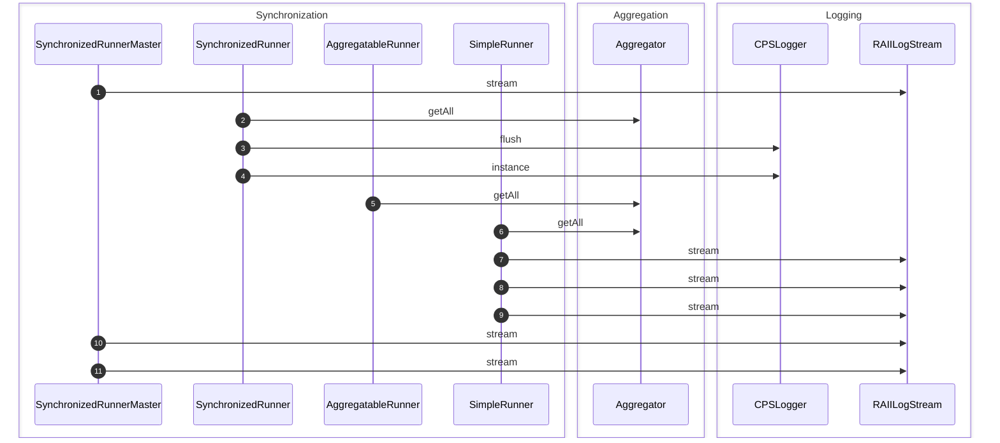
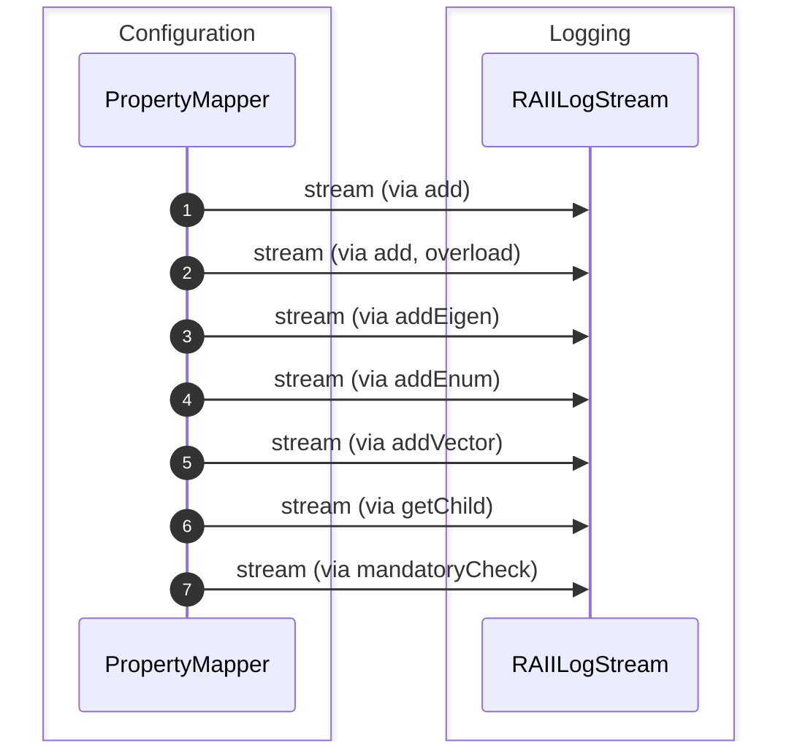
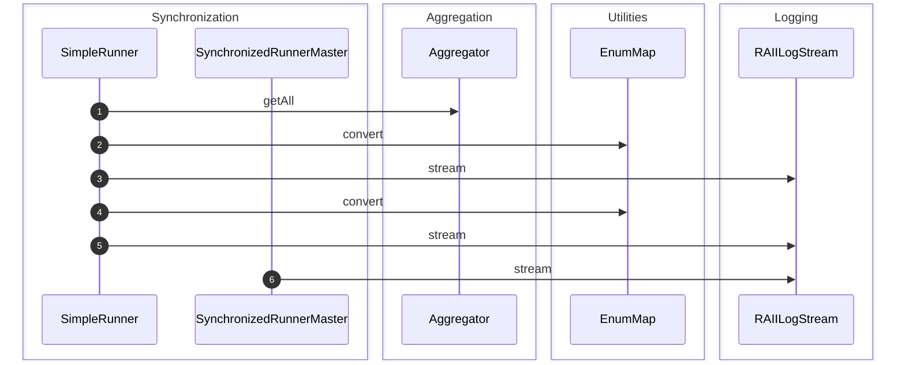
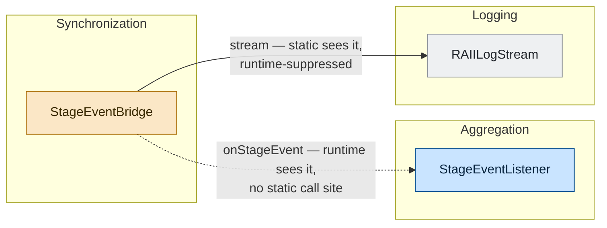
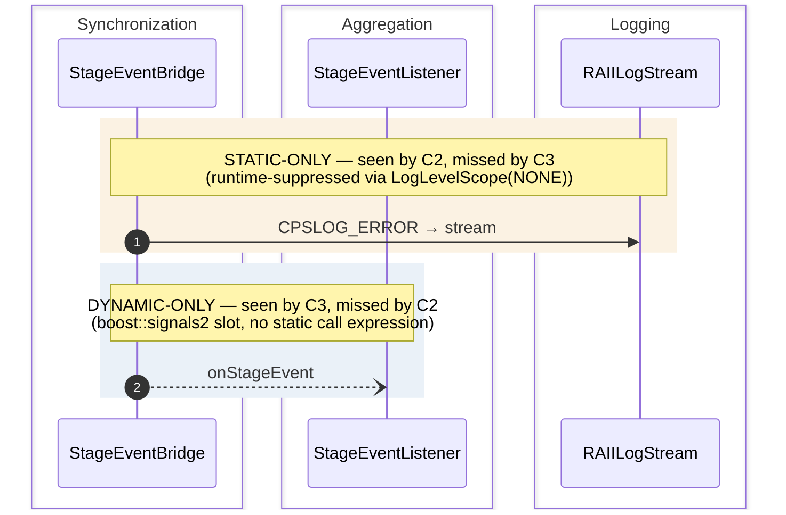

# CPSCore Evaluation Scenarios (S1–S4)

Four scenarios were defined on CPSCore to evaluate the hybrid pipeline (H1/H2/H3). S1–S3 are happy-path behaviour that occurs naturally in the existing code; S4 is a purpose-built pub/sub bridge, added because nothing in S1–S3 has a boundary where static and dynamic evidence each miss a *different* interaction — S4 introduces one.

| Scenario | Nature | Primary component | Targets | Reference interactions |
|---|---|---|---|---|
| **S1** | Happy-path | Synchronization | Aggregation, Logging | 4 — `getAll`, `stream`, `flush`, `instance` |
| **S2** | Happy-path | Configuration | Logging | 1 — `stream` |
| **S3** | Happy-path | Synchronization | Aggregation, Utilities, Logging | 3 — `getAll`, `stream`, `convert` |
| **S4** | Constructed | Synchronization | Aggregation, Logging | 2 — `stream`, `onStageEvent` |

---

## S1 — Aggregator Notification Chain

The observer/notification pattern: `SynchronizedRunner.runSynchronized` → `Aggregator.getAll`, followed by logging calls. The `boost::signals2` callback chain is invisible in a static include graph, making this a test of IDC topology recovery.

---

## S2 — Configuration Property Mapping

A mostly-static, linear chain: `PropertyMapper.add` → `RAIILogStream.stream`. The easy-case baseline, expected to be reconstructed well even by static-only conditions.

---

## S3 — Multi-Component Runner Orchestration

Fan-out from `SimpleRunner.runStage` to multiple independent subsystems at once. The hardest case for static analysis: call targets resolved at runtime via template/virtual dispatch produce two false-positive static edges (`flush`, `instance`) that the full pipeline (C5) eliminates.

---

## S4 — Stage Event Pub-Sub Bridge (constructed)

Unlike S1–S3, this is not an existing code path but two new production files. `StageEventBridge` publishes a stage-completion event over a `boost::signals2::signal`; `StageEventListener` connects `onStageEvent` as a slot with **no static call site anywhere in the codebase**. If no listener is connected, `StageEventBridge` logs a `CPSLOG_ERROR` to `stream`, which is **suppressed at runtime** by a `CPSLogger::LogLevelScope(LogLevel::NONE)` idiom.

This is the one construction in the suite where the static graph (C2) and the runtime trace (C3) each miss a *different* edge, rather than one being a subset of the other — the only scenario where combining them (C4) is strictly additive.

---

## Why these four

| Scenario | What breaks each single source | F1 (static-only, C2) | F1 (dynamic-only, C3) | F1 (union, C4) |
|---|---|---|---|---|
| S1–S3 (happy-path) | Trace edges are a subset of static edges — no cross-module virtual dispatch in CPSCore | 0.917 | **1.000** | 0.917 (= C2) |
| S4 (constructed) | Static and dynamic each miss a *different* edge — the only dual-gap case | 0.667 | 0.667 | **1.000** |

On S1–S3, combining is redundant because static analysis already sees everything the trace does. S4 exists specifically to exercise the regime where combining is strictly additive — which is exactly what a system with cross-module virtual dispatch or plugin loading would look like more broadly.
