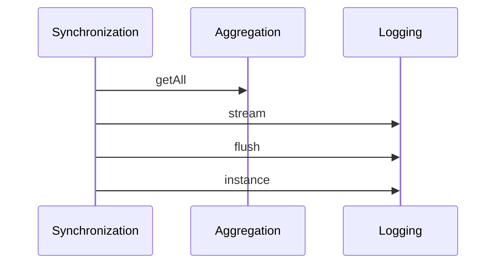
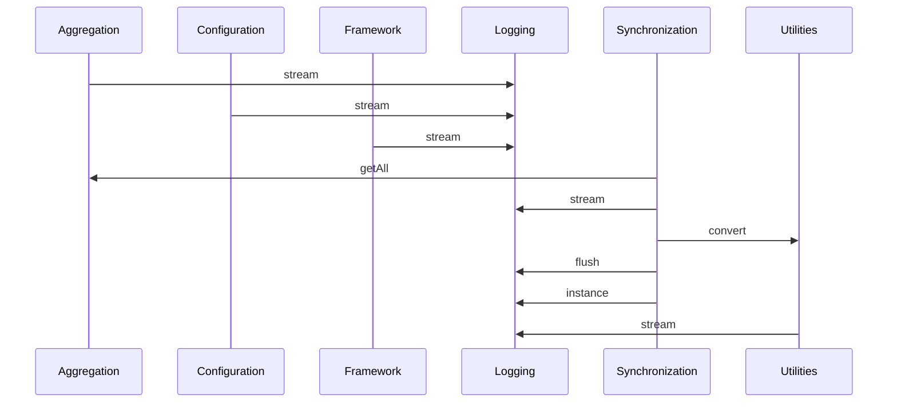
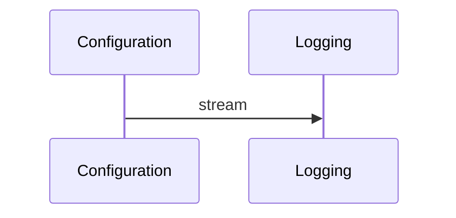
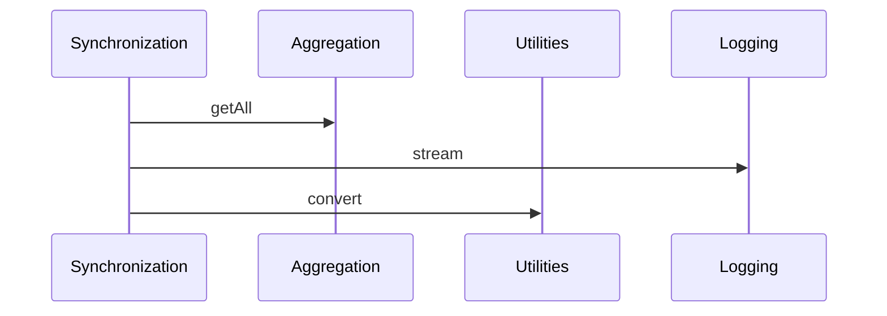

# H2 Expert Rating Form

**Instructions for raters:**  
Below are diagram pairs for three CPSCore execution scenarios.  
For each pair you will see two diagrams labelled **Diagram A** and **Diagram B**.
The labels are randomised — you do not know which instrumentation strategy produced which.

Each diagram shows *inter-component message flows* observed during the scenario's
execution. Components are subsystems of the CPSCore C++ framework; arrows show
function calls from one component to another.

Please rate each diagram on the three criteria below using a **1–5 scale**.  
Fill in the rating tables and add any free-text notes.  
Return to [your name/email] by [DATE].

---

## Rating criteria

| Score | Relevance | Readability | Usefulness |
|-------|-----------|-------------|------------|
| 1 | Most components/calls are irrelevant to the scenario | Very hard to follow | Would not help understand this part of the system |
| 3 | Mix of relevant and irrelevant content | Moderately clear | Somewhat useful for understanding |
| 5 | Only scenario-relevant components and calls | Very easy to follow | Clearly shows the execution flow |

---

## Scenario S1 — Aggregator notification chain

> A Synchronization runner triggers an aggregation update. The runner (Synchronization
> component) retrieves runnable objects from the Aggregation component and flushes the
> logger (Logging component) on completion. Focus: which components does the
> Synchronization runner interact with, and via which calls?

### Diagram A

| Criterion | Rating (1–5) | Notes |
|-----------|:---:|---|
| Relevance | | |
| Readability | | |
| Usefulness | | |

### Diagram B

| Criterion | Rating (1–5) | Notes |
|-----------|:---:|---|
| Relevance | | |
| Readability | | |
| Usefulness | | |

---

## Scenario S2 — Configuration property mapping

> The Configuration component reads and validates properties (strings, vectors,
> enums). Each property read emits a log entry via the Logging component.
> Focus: which components does the Configuration module interact with?

### Diagram A

| Criterion | Rating (1–5) | Notes |
|-----------|:---:|---|
| Relevance | | |
| Readability | | |
| Usefulness | | |

### Diagram B

| Criterion | Rating (1–5) | Notes |
|-----------|:---:|---|
| Relevance | | |
| Readability | | |
| Usefulness | | |

---

## Scenario S3 — Multi-component runner orchestration

> A Synchronization runner orchestrates a run cycle that fans out to multiple
> components: fetching runnable objects (Aggregation), converting stage enum
> values to strings (Utilities), and logging progress (Logging).
> Focus: what is the full fan-out pattern of the Synchronization runner?

### Diagram A

| Criterion | Rating (1–5) | Notes |
|-----------|:---:|---|
| Relevance | | |
| Readability | | |
| Usefulness | | |

### Diagram B

| Criterion | Rating (1–5) | Notes |
|-----------|:---:|---|
| Relevance | | |
| Readability | | |
| Usefulness | | |

---

## Overall impressions (optional)

1. Was there a consistent difference between the two diagram styles across all scenarios?

2. Did you feel one style was systematically easier to use as an architect?

3. Any other comments on the diagrams or rating process?

---

## Rater information

Name: _______________  
Date: _______________  
Familiarity with CPSCore (1=none, 5=expert): ___
