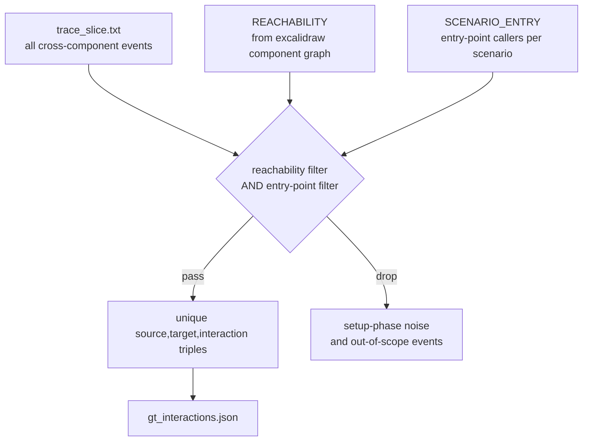

# GT Derivation: Arch-Filter Method (Neo4j-Free)

## Overview

`derive_gt_arch.py` computes `gt_interactions.json` for each scenario without
querying Renaissance/Neo4j. Instead it combines two artefacts that already encode
the same information as the Neo4j call-graph traversal:

| Source | Encodes |
|---|---|
| `trace_slice.txt` | Runtime-observed cross-component calls (dynamic evidence) |
| `arch_filters.py` (REACHABILITY + SCENARIO_ENTRY) | Architectural scope derived from excalidraw diagrams |

The approach achieves **F1 = 1.000** on all four scenarios (S1a, S1b, S2, S3)
relative to the Neo4j-derived GT produced by `derive_gt.py`.

---

## Algorithm



### Step-by-step

1. **Load `trace_slice.txt`** for the scenario.  
   Each row is a cross-component call event with fields:
   `EventName | ClientComponent | ClientFunction | ServerComponent | ServerFunction`.

2. **Apply the reachability filter** — keep rows where  
   `(ClientComponent, ServerComponent) ∈ REACHABILITY`.  
   `REACHABILITY` is the set of component pairs that have at least one annotated
   interaction in the excalidraw architectural diagrams (see [arch_filters.py](../../architectural_diagrams/arch_filters.py)):

   ```
   Aggregation    → Logging
   Configuration  → Logging
   Synchronization → Aggregation
   Synchronization → Logging
   Utilities      → Logging
   ```

3. **Apply the entry-point filter** — keep rows where  
   `ClientFunction ∈ SCENARIO_ENTRY[scenario]`.  
   Each scenario defines the set of `Class.method` functions that are directly
   called by the test case. Events whose `ClientFunction` is not in this set were
   triggered during test *setup* (e.g. `Aggregator.add` firing before the scenario
   logic starts) and must be excluded.

4. **Deduplicate** to unique `(source, target, interaction)` triples and write
   `gt_interactions.json`.

---

## Why `trace_slice.txt` Equals Manual Excalidraw Instrumentation

Each arrow in the excalidraw scenario diagrams represents one cross-component
interaction observed (or expected) during that scenario. For every such arrow there
is an explicit instrumentation site in the C++ source, documented in
[instrumentation_sites.txt](../../architectural_diagrams/instrumentation_sites.txt).

`apply_tracing` (CSP repo) instruments those sites in two ways:

| Coverage tag | Mechanism | NODEBUG safe? |
|---|---|---|
| `[PROBE]` | Explicit call-site probe injected by `apply_tracing` | ✅ always fires |
| `[MACRO-ERROR]` | `CPSLOG_ERROR` / `CPSLOG_WARN` macro | ✅ always fires |
| `[MACRO]` | `CPSLOG_DEBUG` / `CPSLOG_TRACE` macro, patched as `patched=CPSLOG` | ✅ probe injected **outside** the `if(0)` guard |

The consequence is a bijection between excalidraw arrows and trace event types:

```
excalidraw arrow  ──►  instrumentation site  ──►  apply_tracing probe/macro  ──►  trace_slice event
```

### Concrete mapping

| Excalidraw arrow | Instrumentation site | EventName in trace_slice |
|---|---|---|
| Sync → Agg : getAll | `SynchronizedRunner.cpp:52` `[PROBE]` | `Aggregator.getAll` |
| Sync → Agg : getAll | `AggregatableRunner.cpp:46` `[PROBE]` | `Aggregator.getAll` |
| Sync → Log : flush | `SynchronizedRunner.cpp:83` `[PROBE]` | `CPSLogger.flush` |
| Sync → Log : stream (S1b) | `SynchronizedRunnerMaster.cpp:100` `[MACRO-ERROR]` | `RAIILogStream.stream` |
| Util → Log : stream (S3) | `MultiThreadingScheduler.cpp` ×14, `MicroSimulator.cpp` ×3, `SignalHandler.*` `[MACRO]` | `RAIILogStream.stream` |
| Agg → Log : stream (S3) | `ObjectHandleContainer.hpp:195` `[MACRO]` | `RAIILogStream.stream` |
| Config → Log : stream (S2) | `PropertyMapper.hpp:68,416`, `PropertyMapper.cpp:13,26,73` `[MACRO]` | `RAIILogStream.stream` |

Therefore, **filtering `trace_slice.txt` to events that match the REACHABILITY
component pairs recovers exactly the same interaction types as reading the arrows
off the excalidraw diagrams**.  No manual inspection of the diagrams is needed at
query time — the filter is pre-encoded in `arch_filters.py`.

---

## The Entry-Point Filter: Excluding Setup-Phase Noise

The reachability filter alone is not sufficient. In S1a and S1b, `Aggregator.add`
(called during test setup, before `runSynchronized`) fires a `Agg→Log:stream` event.
The pair `(Aggregation, Logging)` is in REACHABILITY, so this event passes the
component filter — but it is not part of the scenario interaction pattern.

The entry-point filter closes this gap:

```
SCENARIO_ENTRY["S1a"] = {SynchronizedRunner.runSynchronized,
                          SynchronizedRunnerMaster.runStage}
```

`Aggregator.add` is not in this set, so the spurious `Agg→Log:stream` is dropped.
Only calls that are **direct callers** of the scenario logic are accepted as
`ClientFunction`.

### Why direct callers are sufficient

In all four scenarios the scenario entry points call into the server component
(Aggregation, Logging, etc.) **without intermediate indirection through another
scenario component**. There is no case where an entry point calls through a second
scenario component before reaching the server. Because of this, checking that
`ClientFunction` belongs to the entry-point set is equivalent to the full
function-level reachability traversal that Neo4j performs with `CppCalls*0..8`.

If a future scenario introduces multi-hop indirection (A → B → C where B is also
a scenario component), the entry-point filter would need to be extended or replaced
with full graph traversal.

---

## Validation Results

Script: inline Python against existing `gt_interactions.json` (Neo4j-derived).

```
=== S1a ===  [reachability+entry]: P=1.000  R=1.000  F1=1.000
=== S1b ===  [reachability+entry]: P=1.000  R=1.000  F1=1.000
=== S2  ===  [reachability+entry]: P=1.000  R=1.000  F1=1.000
=== S3  ===  [reachability+entry]: P=1.000  R=1.000  F1=1.000
```

---

## Output Format

`gt_interactions.json` is a JSON array of objects sorted by `(source, target, interaction)`:

```json
[
  {"source": "Synchronization", "target": "Aggregation", "interaction": "Aggregator.getAll"},
  {"source": "Synchronization", "target": "Logging",     "interaction": "CPSLogger.flush"}
]
```

`interaction` values use the qualified `Class.method` form from `trace_slice.txt`
EventNames (e.g. `Aggregator.getAll`, `CPSLogger.flush`, `RAIILogStream.stream`).
Evaluation scripts that normalise with `.split('.')[-1]` are unaffected.

---

## Files

| File | Role |
|---|---|
| `experiments/scenarios/derive_gt_arch.py` | Script that writes `gt_interactions.json` |
| `architectural_diagrams/arch_filters.py` | REACHABILITY, SCENARIO_ENTRY, filter functions |
| `architectural_diagrams/instrumentation_sites.txt` | Code locations behind each excalidraw arrow |
| `experiments/scenarios/*/trace_slice.txt` | Trace input (cross-component events, pre-filtered by scenario components) |
| `experiments/scenarios/*/gt_interactions.json` | Output ground-truth files |
