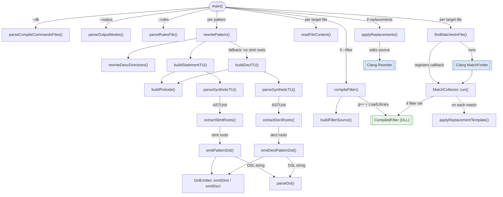

# csp_matcher — function call graph

## Notes

- **Fallback branch**: `buildDeclTU` / `extractDeclRoots` / `emitDeclPatternDsl` are only reached when `extractStmtRoots` returns no roots (e.g. function-declaration patterns).
- **Shared node**: both `buildStatementTU` and `buildDeclTU` call `buildPrelude`.
- **Clang API boundary** (blue): `MatchFinder` and `Rewriter` are Clang library objects, not functions defined in `main.cpp`.
- **DLL boundary** (green): `CompiledFilter` is a runtime-loaded shared library compiled from the user's filter definitions file.
- **`DslEmitter`** is not called directly by `main`; it is internal to `emitPatternDsl` / `emitDeclPatternDsl`.
- **`MatchCollector::run()`** is invoked by `MatchFinder` (Clang callback), not directly by `findMatchesInFile`.
